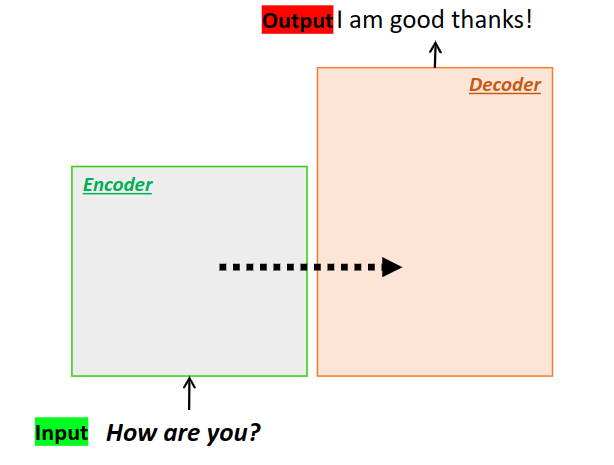

# Understanding the Transformer
These are my notes for the transformer to have a better understanding of the general architecture.
The transformer generally consists of encoder-decoder architecture.



To begin with, we will just introduce this simple function to show how each block is created
for the following layers.

```python
def clones(module, N):
    "Produce N identical layers"
    return nn.ModuleList([copy.deepcopy(module) for _ in range(N)])
```

## Encoder Block
Now we can start with the encoder section. A single encoder layer consists of a multi-head
attention layer and a typical fully-connected layer.


We can see how this section works in the code below. Take not about the sublayer section, this
is what adds the residual information from the previous layer. We'll see this in the next code
block.

```python

class EncoderLayer(nn.Module):
    "Encoder is made up of self-attn and feed-forward"

    def __init__(self, size, self_attn, feed_forward, dropout):
        super(EncoderLayer, self).__init__()
        self.self_attn = self_attn
        self.feed_forward = feed_forward
        self.sublayer = clones(SublayerConnection(size, dropout), 2)
        self.size = size

    def forward(self, x, mask):
        x = self.sublayer[0](x, lambda x: self.self_attn(x, x, x, mask))
        return self.sublayer[1](x, self.feed_forward)
```

The sublayer acts as the way to provide residual information to the output,
we simply normalise the output and then add the output from the previous layer.
The normalisation function is just some simple derivative of the normal distribution
with an added weight and bias term that are learnable for each feature.

```python
class SublayerConnection(nn.Module):
    """
    A residual connection followed by a layer norm.
    Note for code simplicity the norm is first as opposed to last.
    """

    def __init__(self, size, dropout):
        super(SublayerConnection, self).__init__()
        self.norm = LayerNorm(size)
        self.dropout = nn.Dropout(dropout)

    def forward(self, x, sublayer):
        "Apply residual connection to any sublayer with the same size."
        return x + self.dropout(sublayer(self.norm(x)))

class LayerNorm(nn.Module):
    "Construct a layer norm module"

    def __init__(self, features, eps=1e-6):
        super(LayerNorm, self).__init__()
        # These are learnable parameters
        # a_2 acts as weights
        self.a_2 = nn.Parameter(torch.ones(features))
        # b_2 acts as a bias
        self.b_2 = nn.Parameter(torch.zeros(features))
        self.eps = eps

    def forward(self, x):
        # This is like a derivative of the normal distribution
        mean = x.mean(-1, keepdim=True)
        std = x.std(-1, keepdim=True)
        return self.a_2 * (x - mean) / (std + self.eps) + self.b_2
```

We then repeat this layer 6 times to replicate the original architecture. As shown in
the diagram below.


```python
class Encoder(nn.Module):
    "Core encoder is a stack of N layers"

    def __init__(self, layer, N):
        super(Encoder, self).__init__()
        self.layers = clones(layer, N)
        self.norm = LayerNorm(layer.size)

    def forward(self, x, mask):
        "Pass the input (and mask) through each layer in turn"
        for layer in self.layers:
            x = layer(x, mask)
        return self.norm(x)
```

## Attention Block

Now to explain how the multi-headed attention layer works. This simply works by reshaping
our **query**, **key** and **value** inputs to so that we have $h$ inputs for the multi-headed attention
layer, where $h$ is the number of heads of the layer. This the new dimension can be calculated
with the following equation:

$$
d_k = \frac{d_{model}}{h}
$$

Where $d_{model}$ is the original length of the embedding. This is fed into the attention
module (we will discuss this next), and the output we reshape into its original shape. This
part we can consider as the concatenation layer from the diagram.


We do this because the initial parameters of each head of the multi-headed attention is random,
so we will have $h$ heads with different representations learned. This allows us a better
generalisable approximation between the embedding representations of each word in the
fully-connected layers at the beginning and end. At the beginning, each of the query, key and
value inputs have their own separate fully-connected layer, and then they are all fed through
the same final fully-connected layer at the end with the attention output.

```python

class MultiHeadedAttention(nn.Module):
    def __init__(self, h, d_model, dropout=0.1):
        "Take in model size and number of heads"
        super(MultiHeadedAttention, self).__init__()
        assert d_model % h == 0
        # We assume d_v always equals d_k
        self.d_k = d_model // h
        self.h = h
        self.linears = clones(nn.Linear(d_model, d_model), 4)
        self.attn = None
        self.dropout = nn.Dropout(p=dropout)

    def forward(self, query, key, value, mask=None):
        if mask is not None:
            # Same mask applied to all h heads
            mask = mask.unsqueeze(1)
        nbatches = query.size(0)

        # 1) Do all the linear projections in batch from d_model => h x d_k
        query, key, value = [
            lin(x).view(nbatches, -1, self.h, self.d_k).transpose(1, 2)
            for lin, x in zip(self.linears, (query, key, value))
        ]

        # 2) Apply attention on all the projected vectors in batch
        x, self.attn = attention(
            query, key, value, mask=mask, dropout=self.dropout
        )

        # 3) "Concat" using a view and apply a final linear
        x = (
            x.transpose(1, 2)
            .contiguous()
            .view(nbatches, -1, self.h * self.d_k)
        )

        return self.linears[-1](x)
```

So for the attention layer, we firstly perform a scaled dot-product between the query and
key embeddings and then perform softmax on the output. We do this to get a probability
distribution between of which words have the closest relationship between other words in the
embeddings. This probability, we then perform another dot product with the values embeddings.
The end result, is our attention output! The formula for how we do this is shown below:

$$
Attention(Q,K,V) = \text{softmax}(\frac{QK^T}{\sqrt{d_k}})V
$$

A visual representation of this section at work can be seen in the diagram below.


The code block is shown below. Note the masking layer. This is to ensure that each word
is only learning dependencies with previous words in the sequence, and not words later in
the sequence.

```python
def attention(query, key, value, mask=None, dropout=None):
    "Compute 'Scaled dot product Attention'"
    d_k = query.size(-1)
    scores = torch.matmul(query, key.transpose(-2, -1)) / math.sqrt(d_k)
    if mask is not None:
        scores = scores.masked_fill(mask == 0, -1e9)
    p_attn = scores.softmax(dim=-1)
    if dropout is not None:
        p_attn = dropout(p_attn)
    return torch.matmul(p_attn, value), p_attn
```

To visualise what is happening in total, you can look at the diagram below


## Feedforward Layer
The feedforward layer is just a simple fully connected layer. I don't think any
explanation is required for this, so the code block is provided below.


```python
class PositionwiseForward(nn.Module):
    "Implements FFN equation"

    def __init__(self, d_model, d_ff, dropout=0.1):
        super(PositionwiseForward, self).__init__()
        self.w_1 = nn.Linear(d_model, d_ff)
        self.w_2 = nn.Linear(d_ff, d_model)
        self.dropout = nn.Dropout(dropout)

    def forward(self, x):
        x = self.w_1(x).relu()
        x = self.dropout(x)
        return self.w_2(x)
```


## Decoder Block
Now let's discuss the decoder block. This is similar to the encoder block, however there
are some important differences. As can be seen in the diagram below, each decoder block is
receiving residual information from the output of the encoder layer. We will consider this to
be the **memory** of the encoder for the decoder to remember. This can be seen in the diagram that
was previously presented, but will show it again below for convenience.


Also note that the architecture of the decoder actually includes **two multi-head attention
layers**. The code block to write this section is shown below. Note how that for the
**second** attention layer, the key and values are actually the output of the encoder.
This means that we will be trying to find from the decoder input what words have the highest
correlation with the embedding output of the **encoder** layer.

```python
class Decoder(nn.Module):
    "Generic N layer decoder with masking"

    def __init__(self, layer, N):
        super(Decoder, self).__init__()
        self.layers = clones(layer, N)
        self.norm = LayerNorm(layer.size)

    def forward(self, x, memory, src_mask, tgt_mask):
        for layer in self.layers:
            x = layer(x, memory, src_mask, tgt_mask)
        return self.norm(x)


class DecoderLayer(nn.Module):
    "Decoder is made of self-attn, src-attn and feed-forward"

    def __init__(self, size, self_attn, src_attn, feed_forward, dropout):
        super(DecoderLayer, self).__init__()
        self.size = size
        self.self_attn = self_attn
        self.feed_forward = feed_forward
        self.sublayer = clones(SublayerConnection(size, dropout), 3)

    def forward(self, x, memory, src_mask, tgt_mask):
        m = memory
        x = self.sublayer[0](x, lambda x: self.self_attn(x, x, x, tgt_mask))
        x = self.sublayer[1](x, lambda x: self.self_attn(x, m, m, src_mask))
        return self.sublayer[2](x, self.feed_forward)
```

## Positional Encoding
Now one issue with this architecture is that it doesn't naturally consider the sequential
nature of language and thus as now concept of where each word embedding is positioned.
As a result, we need to add that information into each embedding.

We want to do this in a way where we can include this information without having to increase
the dimensions or lose the information when the dimensions of the embeddings change. One great
way to do this is by using sine and cosine functions. Since their positions at a certain
position are complete opposites, we can capture every single position with no clashes. The way
we do this is by applying every even position with the sine function, and every odd position
with the cosine function. The formulas for how this works are shown below.

$$
PE_{(pos,2i)} = \sin(pos/10000^{2i/d_{model}})
$$

$$
PE_{(pos,2i+1)} = \cos(pos/10000^{2i/d_{model}})
$$

Additionally, we can add dropout to this layer. The codeblock for this layer can be seen below.

```python
class PositionalEncoding(nn.Module):
    "Implement the PE function."

    def __init__(self, d_model, dropout, max_len=5000):
        super(PositionalEncoding, self).__init__()
        self.droput = nn.Dropout(p=dropout)

        # COmpute the positional encodings once in log space
        pe = torch.zeros(max_len, d_model)
        position = torch.arange(0, max_len).unsqueeze(1)
        div_term = torch.exp(
            torch.arange(0, d_model, 2) * -(math.log(1000.0) / d_model)
        )
        pe[:, 0::2] = torch.sin(position * div_term)
        pe[:, 1::2] = torch.cos(position * div_term)
        pe = pe.unsqueeze(0)
        self.register_buffer("pe", pe)

    def forward(self, x):
        x = x + self.pe[:, :x.size(1)].requires_grad_(False)
        return self.dropout(x)
```

## Embedding Block
Now we understand this fundamental aspect of the embedding layer, we can show the
embedding layer, which is the same as any other embedding layer, except we also multiply it
by $\sqrt{d_{model}}$. The code block can be seen below.

```python
class Embeddings(nn.Module):
    def __init__(self, d_model, vocab):
        super(Embeddings, self).__init__()
        self.lut = nn.Embedding(vocab, d_model)
        self.d_model = d_model

    def forward(self, x):
        return self.lut(x) * math.sqrt(self.d_model)
```

## Assembling the Transformer
We can now finally assemble all the lego pieces with the following codeblock. You should be
able to understand every aspect to the modules included now!

```python
def make_model(
    src_vocab, tgt_vocab, N=6, d_model=512, d_ff=2048, h=8, dropout=0.1
):
    "Helper: Construct a model from hyperparameters"
    c = copy.deepcopy
    attn = MultiHeadedAttention(h, d_model)
    ff = PositionwiseForward(d_model, d_ff, dropout)
    position = PositionalEncoding(d_model, dropout)
    model = EncoderDecoder(
        Encoder(EncoderLayer(d_model, c(attn), c(ff), dropout), N),
        Decoder(DecoderLayer(d_model, c(attn), c(attn), c(ff), dropout), N),
        nn.Sequential(Embeddings(d_model, src_vocab), c(position)),
        nn.Sequential(Embeddings(d_model, tgt_vocab), c(position)),
        Generator(d_model, tgt_vocab),
    )

    for p in model.parameters():
        if p.ndim > 1:
            nn.init.xavier_normal_(p)
    return model
```
